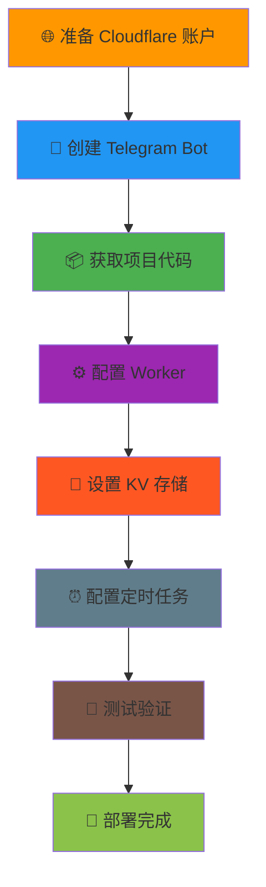

<div align="center">

# 🚀 RSS to Telegram

<p align="center">
  
</p>

<p align="center">
  <strong>🎯 基于 Cloudflare Workers 的下一代 RSS 推送解决方案</strong>
</p>

<p align="center">
  
  
</p>

<p align="center">
  
  
  
  
</p>

<p align="center">
  
  
  
  
</p>

<div align="center">

### 🎉 让 RSS 订阅变得简单而强大

**自动监控您关注的内容，智能推送到 Telegram**

</div>

<table align="center">
<tr>
<td align="center" width="25%">

**📡 智能监控**<br>
自动检测 RSS 更新<br>
支持多种格式

</td>
<td align="center" width="25%">

**⚡ 即时推送**<br>
实时推送到 Telegram<br>
支持频道/群组/私聊

</td>
<td align="center" width="25%">

**🌐 可视化管理**<br>
直观的 Web 界面<br>
一键配置和管理

</td>
<td align="center" width="25%">

**💰 完全免费**<br>
基于 Cloudflare<br>
无需服务器成本

</td>
</tr>
</table>

<p align="center">
  <a href="#-快速开始"></a>
  <a href="#-项目特色"></a>
  <a href="#-详细部署教程"></a>
  <a href="#-使用说明"></a>
</p>

</div>

---

<div align="center">

## 📑 文档导航

**📍 快速定位您需要的内容**

</div>

<table>
<tr>
<td width="25%" align="center">

### 🚀 新手入门

<div align="left">

- [✨ 项目特色](#-项目特色)
- [🚀 快速开始](#-快速开始)
- [📋 前置准备](#-前置准备)
- [📖 使用说明](#-使用说明)

</div>

<div align="center">


</div>

</td>
<td width="25%" align="center">

### 📚 部署指南

<div align="left">

- [🌐 一键部署](#-一键部署推荐)
- [🍴 Fork 部署](#-fork-部署推荐)
- [🛠️ 手动部署](#-手动部署传统方式)
- [⚙️ 配置服务](#️-配置服务)

</div>

<div align="center">


</div>

</td>
<td width="25%" align="center">

### 🔧 进阶配置

<div align="left">

- [🔧 配置选项](#-配置选项)
- [🧪 测试验证](#-测试验证)
- [📊 系统监控](#-系统监控)
- [🔒 安全说明](#-安全说明)

</div>

<div align="center">


</div>

</td>
<td width="25%" align="center">

### 🆘 帮助支持

<div align="left">

- [🆘 故障排除](#-故障排除)
- [💡 最佳实践](#-最佳实践)
- [📄 许可证](#-许可证)
- [🤝 贡献指南](#-贡献)

</div>

<div align="center">


</div>

</td>
</tr>
</table>

<div align="center">

### 🎯 推荐阅读路径

</div>

<table>
<tr>
<td width="33%" align="center">

#### 🔰 新手用户

```
1️⃣ 项目特色
2️⃣ 一键部署
3️⃣ 使用说明
4️⃣ 故障排除
```

**⏱️ 预计用时：15分钟**

</td>
<td width="33%" align="center">

#### 👨‍💻 开发者

```
1️⃣ Fork 部署
2️⃣ 配置选项
3️⃣ 系统监控
4️⃣ 最佳实践
```

**⏱️ 预计用时：30分钟**

</td>
<td width="33%" align="center">

#### 🎓 学习者

```
1️⃣ 手动部署
2️⃣ 测试验证
3️⃣ 安全说明
4️⃣ 贡献指南
```

**⏱️ 预计用时：45分钟**

</td>
</tr>
</table>

## ✨ 项目特色

<div align="center">

### 🎯 为什么选择 RSS to Telegram？

**集成最佳技术，提供卓越体验**

</div>

<table>
<tr>
<td width="33%" align="center">

### 🚀 极简部署

<div align="center">


</div>

- ⚡ **一键部署** - 无需复杂配置
- 🔧 **零维护** - 自动扩展和更新
- 💰 **完全免费** - 基于 Cloudflare 免费额度
- 🌍 **全球可用** - CDN 加速访问

</td>
<td width="33%" align="center">

### 📡 智能监控

<div align="center">


</div>

- 📊 **多源支持** - RSS/Atom/JSON Feed
- 🔍 **智能解析** - 自动识别内容格式
- ⏰ **定时检查** - 可自定义检查间隔
- 📱 **即时推送** - 新内容立即通知

</td>
<td width="33%" align="center">

### 🎨 用户体验

<div align="center">


</div>

- 🌐 **Web 管理** - 直观的可视化界面
- 📱 **移动优化** - 完美支持手机操作
- 🧪 **测试功能** - 一键测试推送效果
- 🔒 **数据安全** - 企业级存储保护

</td>
</tr>
</table>

<div align="center">

### 🤖 AI 驱动开发

<table>
<tr>
<td width="50%" align="center">

#### 🚀 Cursor AI 助力

<div align="center">


</div>

- 🧠 **智能编程** - AI 辅助代码生成
- 🔍 **代码审查** - 自动安全检查
- ⚡ **快速迭代** - 高效开发流程
- 🎯 **质量保证** - 最佳实践应用

</td>
<td width="50%" align="center">

#### ✨ 技术优势

<div align="center">


</div>

- 📝 **代码质量** - AI 优化的代码结构
- 🛡️ **安全增强** - 智能安全防护
- 🚀 **性能优化** - AI 驱动的性能调优
- 📚 **文档完善** - 自动生成详细文档

</td>
</tr>
</table>

</div>

<div align="center">

### 🏆 核心优势对比

</div>

<table>
<tr>
<td width="20%" align="center"><strong>对比项目</strong></td>
<td width="20%" align="center"><strong>RSS to Telegram</strong></td>
<td width="20%" align="center"><strong>传统方案</strong></td>
<td width="20%" align="center"><strong>自建服务</strong></td>
<td width="20%" align="center"><strong>付费服务</strong></td>
</tr>
<tr>
<td align="center">💰 <strong>成本</strong></td>
<td align="center">🟢 <strong>完全免费</strong></td>
<td align="center">🟡 低成本</td>
<td align="center">🔴 服务器费用</td>
<td align="center">🔴 订阅费用</td>
</tr>
<tr>
<td align="center">⚡ <strong>部署</strong></td>
<td align="center">🟢 <strong>2分钟</strong></td>
<td align="center">🟡 10-30分钟</td>
<td align="center">🔴 数小时</td>
<td align="center">🟢 即时</td>
</tr>
<tr>
<td align="center">🔧 <strong>维护</strong></td>
<td align="center">🟢 <strong>零维护</strong></td>
<td align="center">🟡 定期更新</td>
<td align="center">🔴 持续维护</td>
<td align="center">🟢 托管服务</td>
</tr>
<tr>
<td align="center">🎨 <strong>自定义</strong></td>
<td align="center">🟢 <strong>完全开源</strong></td>
<td align="center">🟡 有限定制</td>
<td align="center">🟢 完全控制</td>
<td align="center">🔴 功能受限</td>
</tr>
<tr>
<td align="center">🔒 <strong>隐私</strong></td>
<td align="center">🟢 <strong>数据自控</strong></td>
<td align="center">🟡 部分控制</td>
<td align="center">🟢 完全控制</td>
<td align="center">🔴 第三方托管</td>
</tr>
</table>

<div align="center">

### 🎯 适用场景

</div>

<table>
<tr>
<td width="25%" align="center">

#### 📰 新闻聚合

- 🌐 多个新闻源
- ⚡ 实时资讯推送
- 📱 移动端阅读

**适合：新闻爱好者**

</td>
<td width="25%" align="center">

#### 📝 博客订阅

- ✍️ 技术博客更新
- 🎯 个人兴趣内容
- 📚 知识管理

**适合：学习者**

</td>
<td width="25%" align="center">

#### 👥 团队协作

- 📊 项目动态通知
- 🔔 重要信息推送
- 💼 工作流集成

**适合：团队/企业**

</td>
<td width="25%" align="center">

#### 🤖 自动化

- 🔄 内容自动分发
- 📈 数据监控告警
- 🎛️ 系统集成

**适合：开发者**

</td>
</tr>
</table>

## 🚀 快速开始

<div align="center">

### ⚡ 从零到运行，只需 5 分钟

**选择最适合您的部署方式**

</div>

<table>
<tr>
<td width="33%" align="center">

### 🌟 推荐方式

<div align="center">

[](https://deploy.workers.cloudflare.com/?url=https://github.com/kvein10086/RSS_to_Telegram)


</div>

**🎯 适合所有用户**
- ✅ 无需技术背景
- ✅ 2分钟完成部署
- ✅ 自动配置环境

</td>
<td width="33%" align="center">

### 🍴 开发者方式

<div align="center">

<a href="#-fork-部署推荐">

</a>

</div>

**👨‍💻 适合开发者**
- ✅ 完全控制代码
- ✅ 自动化 CI/CD
- ✅ 便于自定义

</td>
<td width="33%" align="center">

### 🛠️ 学习方式

<div align="center">

<a href="#-手动部署传统方式">

</a>

</div>

**🎓 适合学习者**
- ✅ 深度理解原理
- ✅ 完整学习过程
- ✅ 技能提升

</td>
</tr>
</table>

<div align="center">

### 📋 部署前准备清单

**确保您已准备以下内容**

</div>

<table>
<tr>
<td width="50%">

#### 🔑 必需账户

<table>
<tr>
<td width="50%" align="center">

**🌐 Cloudflare**

<div align="center">

[](https://www.cloudflare.com/)

</div>

- ✅ 完全免费
- ✅ 无需信用卡
- ✅ 全球 CDN

</td>
<td width="50%" align="center">

**📱 Telegram**

<div align="center">

[](https://telegram.org/)

</div>

- ✅ 手机/电脑
- ✅ 创建 Bot
- ✅ 获取 Chat ID

</td>
</tr>
</table>

</td>
<td width="50%">

#### ⏱️ 时间估算

<table>
<tr>
<td align="center">

**部署方式**

</td>
<td align="center">

**预计时间**

</td>
<td align="center">

**技术要求**

</td>
</tr>
<tr>
<td align="center">🌟 一键部署</td>
<td align="center">**2分钟**</td>
<td align="center">⭐</td>
</tr>
<tr>
<td align="center">🍴 Fork 部署</td>
<td align="center">**5分钟**</td>
<td align="center">⭐⭐</td>
</tr>
<tr>
<td align="center">🛠️ 手动部署</td>
<td align="center">**10分钟**</td>
<td align="center">⭐⭐⭐</td>
</tr>
</table>

</td>
</tr>
</table>

</div>

### 🚀 部署方式选择

<div align="center">

| 方式 | 难度 | 时间 | 推荐人群 |
|------|------|------|----------|
| 🌐 [一键部署](#-一键部署推荐) | ⭐ | 2分钟 | 🔰 所有用户 |
| 🍴 [Fork 部署](#-fork-部署推荐) | ⭐⭐ | 5分钟 | 👨‍💻 开发者 |
| 📋 [手动部署](#-手动部署传统方式) | ⭐⭐⭐ | 10分钟 | 🎓 学习者 |

</div>

### 🚀 一键部署（推荐）

<div align="center">

[](https://deploy.workers.cloudflare.com/?url=https://github.com/kvein10086/RSS_to_Telegram)

**🎉 最简单的部署方式，2分钟完成！**

</div>

**部署步骤**：
1. 🖱️ 点击上方的 "Deploy to Cloudflare Workers" 按钮
2. 🔐 登录您的 Cloudflare 账户
3. ⚙️ 系统自动创建 Worker 和 KV 存储
4. 🎯 访问生成的 URL 开始配置

### 🍴 Fork 部署（推荐）

<div align="center">

**🛠️ 适合开发者的最佳部署方式**

**拥有自己的代码仓库，便于自定义和维护**

</div>

#### 🎯 Fork 部署的优势

<table>
<tr>
<td width="25%" align="center">

##### 🔧 完全控制

**代码自主权**
- ✅ 拥有完整代码副本
- ✅ 可以自定义功能
- ✅ 独立的版本控制

</td>
<td width="25%" align="center">

##### 🔄 便于更新

**同步上游更新**
- ✅ 获取最新功能
- ✅ 安全补丁及时更新
- ✅ 保留个人修改

</td>
<td width="25%" align="center">

##### 🚀 CI/CD 集成

**自动化部署**
- ✅ GitHub Actions 支持
- ✅ 代码推送自动部署
- ✅ 多环境管理

</td>
<td width="25%" align="center">

##### 📊 数据安全

**隐私保护**
- ✅ 私有仓库选项
- ✅ 配置信息隔离
- ✅ 访问权限控制

</td>
</tr>
</table>

#### 📋 详细部署步骤

<div align="center">

##### 🔄 第一步：Fork 仓库

</div>

<table>
<tr>
<td width="50%">

**🖱️ 操作步骤**：

1. **🌐 访问原仓库**
   - 打开 [RSS_to_Telegram](https://github.com/kvein10086/RSS_to_Telegram)

2. **🍴 点击 Fork 按钮**
   - 位于页面右上角
   - 选择您的 GitHub 账户

3. **⚙️ 配置 Fork 选项**
   - 📝 仓库名称（可自定义）
   - 📄 描述信息（可选）
   - 🔒 公开/私有（推荐私有）

4. **✅ 创建 Fork**
   - 点击 "Create fork" 按钮
   - 等待仓库复制完成

</td>
<td width="50%">

**📱 界面示例**：

```
┌─────────────────────────────────┐
│  kvein10086/RSS_to_Telegram     │
│  ⭐ 1.2k    🍴 Fork             │
├─────────────────────────────────┤
│                                 │
│  Repository name *              │
│  ┌─────────────────────────────┐ │
│  │ RSS_to_Telegram             │ │
│  └─────────────────────────────┘ │
│                                 │
│  Description (optional)         │
│  ┌─────────────────────────────┐ │
│  │ RSS to Telegram pusher      │ │
│  └─────────────────────────────┘ │
│                                 │
│  ☑️ Copy the main branch only   │
│                                 │
│  🔒 Private  ⚪ Public          │
│                                 │
│  [ Create fork ]                │
└─────────────────────────────────┘
```

**⏱️ 预计时间**：1分钟

</td>
</tr>
</table>

<div align="center">

##### 🚀 第二步：在 Cloudflare 中连接 GitHub 仓库

</div>

<table>
<tr>
<td width="50%">

**🌐 访问 Cloudflare Dashboard**：

1. **🔐 登录 Cloudflare**
   - 访问 [Cloudflare Dashboard](https://dash.cloudflare.com/)
   - 使用您的账户登录

2. **📂 进入 Workers & Pages**
   - 点击左侧菜单 "Workers & Pages"
   - 选择 "Create application"

3. **⚙️ 选择 Workers 标签**
   - 点击 "Workers" 标签
   - 选择 "Create Worker"

4. **📝 设置 Worker 名称**
   - 输入名称：`rss-to-telegram`（可自定义）
   - 点击 "Deploy"

</td>
<td width="50%">

**🔗 连接 GitHub 仓库**：

5. **📁 进入 Worker 设置**
   - 部署完成后，点击 "Edit code"
   - 或者进入 Worker 详情页

6. **🔧 配置 Git 集成**
   - 在 Worker 编辑器中，点击右上角设置
   - 选择 "Settings" → "Triggers"
   - 点击 "Add Custom Domain" 下方的 "Git Integration"

7. **🔐 连接您的仓库**
   - 选择 "Connect Git repository"
   - 授权 GitHub 访问
   - 选择您的 Fork 仓库：`YOUR_USERNAME/RSS_to_Telegram`

**⏱️ 预计时间**：3-5分钟

</td>
</tr>
</table>

<div align="center">

#### 📱 详细操作指南

</div>

<table>
<tr>
<td width="33%" align="center">

##### 1️⃣ 创建 Worker

```
Cloudflare Dashboard
├── Workers & Pages
│   ├── [Create application]
│   │   ├── [Workers] ← 选择这个
│   │   └── [Pages]
│   └── [Create Worker] ← 点击
```

**操作**：
- 选择 "Workers" 标签
- 点击 "Create Worker"
- 输入 Worker 名称

</td>
<td width="33%" align="center">

##### 2️⃣ 编辑代码

```
Worker 编辑器
├── 📝 Code Editor
├── ⚙️ Settings
│   ├── General
│   ├── Triggers
│   ├── Variables ← 稍后配置
│   └── KV Namespace Bindings
└── 🔗 Git Integration ← 重点
```

**操作**：
- 进入 Worker 设置
- 配置 Git 集成
- 连接您的仓库

</td>
<td width="33%" align="center">

##### 3️⃣ 自动同步

```
Git Integration
├── 🔗 Connected Repository
│   └── YOUR_USERNAME/RSS_to_Telegram
├── 🌿 Branch: main
├── 📁 Entry point: src/worker.js
└── ✅ Auto-deploy: Enabled
```

**结果**：
- 代码自动同步
- 推送即部署
- 完全托管的 CI/CD

</td>
</tr>
</table>

<div align="center">

##### ✅ 第三步：配置 KV 存储和环境变量

</div>

<table>
<tr>
<td width="50%">

**💾 创建 KV 命名空间**：

1. **🔧 创建 KV 存储**
   - 在 Cloudflare Dashboard 中
   - 进入 "Workers & Pages" → "KV"
   - 点击 "Create a namespace"
   - 名称：`RSS_CONFIG`

2. **🔗 绑定到 Worker**
   - 返回您的 Worker 设置
   - 进入 "Settings" → "Variables"
   - 在 "KV Namespace Bindings" 部分
   - 点击 "Add binding"

</td>
<td width="50%">

**⚙️ 配置绑定设置**：

3. **📝 设置绑定信息**
   - **Variable name**: `RSS_CONFIG`
   - **KV namespace**: 选择刚创建的 `RSS_CONFIG`
   - 点击 "Save"

4. **🔄 触发重新部署**
   - 配置完成后，Worker 会自动重新部署
   - 或者手动触发部署

5. **🌐 获取 Worker URL**
   - 复制 Worker 的访问 URL
   - 格式：`https://rss-to-telegram.YOUR_SUBDOMAIN.workers.dev`

</td>
</tr>
</table>

<div align="center">

#### 🔄 自动部署已内置

**🎉 好消息：通过 Cloudflare Pages 连接 GitHub 后，自动部署功能已经内置！**

</div>

<table>
<tr>
<td width="50%" align="center">

##### 🚀 自动触发条件

- ✅ **代码推送**：推送到 main 分支
- ✅ **Pull Request**：合并 PR 时
- ✅ **手动触发**：在 Dashboard 中手动部署

**无需额外配置 GitHub Actions！**

</td>
<td width="50%" align="center">

##### 📊 部署监控

- 🔍 **实时状态**：在 Cloudflare Dashboard 查看
- 📝 **部署日志**：详细的构建和部署日志
- 🔔 **通知设置**：可配置邮件通知

**完全托管的 CI/CD 流程！**

</td>
</tr>
</table>

#### 🎉 Fork 部署完成

<div align="center">

**恭喜！您现在拥有了自己的 RSS to Telegram 服务**

| 优势 | 说明 |
|------|------|
| 🔧 **完全控制** | 可以修改代码，添加自定义功能 |
| 🔄 **便于更新** | 通过 GitHub 同步上游更新 |
| 🚀 **自动部署** | 代码推送后自动部署到 Cloudflare |
| 🔒 **隐私保护** | 配置信息存储在您的私有仓库中 |

</div>

### 📋 手动部署（传统方式）

<details>
<summary><strong>🎓 点击展开手动部署步骤（适合学习者）</strong></summary>

```bash
# 1. 安装 Wrangler CLI
npm install -g wrangler

# 2. 登录 Cloudflare
wrangler auth login

# 3. 下载项目
git clone https://github.com/kvein10086/RSS_to_Telegram.git
cd RSS_to_Telegram

# 4. 创建 KV 存储
wrangler kv:namespace create "RSS_CONFIG"
wrangler kv:namespace create "RSS_CONFIG" --preview

# 5. 编辑 wrangler.toml（替换 KV ID）
# 6. 部署
wrangler deploy
```

</details>


---

<div align="center">

### 🎉 部署完成后的下一步

| 步骤 | 说明 | 链接 |
|------|------|------|
| 1️⃣ **获取 Telegram 配置** | 创建 Bot 并获取 Token 和 Chat ID | [📋 前置准备](#-前置准备) |
| 2️⃣ **配置推送服务** | 在 Web 界面中配置 Telegram | [⚙️ 配置服务](#️-配置服务) |
| 3️⃣ **添加 RSS 源** | 添加您想要订阅的 RSS 源 | [📖 使用说明](#-使用说明) |
| 4️⃣ **测试推送** | 验证推送功能是否正常工作 | [🧪 测试验证](#-测试验证) |

</div>

---

# 📚 详细部署教程

<div align="center">

## 🎯 完整部署流程

**从零开始，10分钟完成专业部署**

</div>

<div align="center">

### 📋 部署流程图



</div>

<table>
<tr>
<td width="14%" align="center">

### 1️⃣
**🌐 Cloudflare**
<br>
注册账户
<br>
*2分钟*

</td>
<td width="14%" align="center">

### 2️⃣
**🤖 Telegram**
<br>
创建 Bot
<br>
*2分钟*

</td>
<td width="14%" align="center">

### 3️⃣
**📦 获取代码**
<br>
下载项目
<br>
*1分钟*

</td>
<td width="14%" align="center">

### 4️⃣
**⚙️ 配置**
<br>
设置 Worker
<br>
*2分钟*

</td>
<td width="14%" align="center">

### 5️⃣
**💾 存储**
<br>
创建 KV
<br>
*1分钟*

</td>
<td width="14%" align="center">

### 6️⃣
**⏰ 定时**
<br>
配置任务
<br>
*1分钟*

</td>
<td width="14%" align="center">

### 7️⃣
**🧪 测试**
<br>
验证功能
<br>
*1分钟*

</td>
</tr>
</table>

<div align="center">

**⏱️ 总计用时：约 10 分钟** | **💰 总计费用：完全免费** | **🔧 技术要求：无需编程经验**

</div>

## 📋 前置准备

<div align="center">

### 🎯 开始之前，您需要准备以下内容

</div>

<table>
<tr>
<td width="50%">

### 1️⃣ Cloudflare 账户

<div align="center">

[](https://www.cloudflare.com/)

</div>

**步骤**：
1. 🌐 访问 [Cloudflare 官网](https://www.cloudflare.com/)
2. 📝 注册免费账户
3. ✉️ 验证邮箱
4. ✅ 完成账户设置

**💡 提示**：Cloudflare 免费额度足够个人使用

</td>
<td width="50%">

### 2️⃣ Telegram Bot

<div align="center">

[](https://t.me/BotFather)

</div>

**步骤**：
1. 🔍 搜索 `@BotFather`
2. 💬 发送 `/newbot`
3. 📝 输入机器人名称
4. 🤖 输入用户名（以 `bot` 结尾）
5. 🔑 **保存 Bot Token**

**💡 提示**：Token 格式如 `1234567890:ABC...`

</td>
</tr>
</table>

### 🎯 获取 Telegram Chat ID

<div align="center">

**🤖 使用 @getmyid_bot 快速获取 Chat ID**

**最简单、最准确的获取方式！**

</div>

#### 🚀 推荐方法：使用 @getmyid_bot

<table>
<tr>
<td width="50%">

##### 📱 操作步骤

1. **🔍 搜索 Bot**
   - 在 Telegram 中搜索 `@getmyid_bot`
   - 点击进入对话

2. **💬 发送命令**
   - 发送 `/start` 命令
   - Bot 会立即回复您的 Chat ID

3. **📋 复制 ID**
   - 复制 Bot 返回的数字
   - 这就是您的 Chat ID

**⏱️ 用时**：30秒完成！

</td>
<td width="50%">

##### 🎯 不同场景的获取方法

**💬 个人私聊 ID**：
- 直接与 @getmyid_bot 对话
- 发送 `/start`
- 获得正数 ID（如：`123456789`）

**👥 群组 Chat ID**：
- 将 @getmyid_bot 添加到群组
- 在群组中发送 `/start@getmyid_bot`
- 获得负数 ID（如：`-987654321`）

**📢 频道 Chat ID**：
- 将 @getmyid_bot 添加为频道管理员
- 在频道中发送任意消息
- 转发该消息给 @getmyid_bot
- 获得负数 ID（如：`-1001234567890`）

</td>
</tr>
</table>

<div align="center">

#### 🎨 获取过程示例

</div>

<table>
<tr>
<td width="33%" align="center">

##### 💬 私聊获取

```
您: /start

@getmyid_bot:
🆔 Your user ID: 123456789
👤 First name: 张三
🏷 Username: @zhangsan
```

**Chat ID**: `123456789`

</td>
<td width="33%" align="center">

##### 👥 群组获取

```
您: /start@getmyid_bot

@getmyid_bot:
🆔 Chat ID: -987654321
👥 Chat type: group
🏷 Chat title: 我的群组
👤 Your ID: 123456789
```

**Chat ID**: `-987654321`

</td>
<td width="33%" align="center">

##### 📢 频道获取

```
1. 添加 @getmyid_bot 为管理员
2. 发送消息并转发给 Bot

@getmyid_bot:
🆔 Chat ID: -1001234567890
📢 Chat type: channel
🏷 Chat title: 我的频道
```

**Chat ID**: `-1001234567890`

</td>
</tr>
</table>

<details>
<summary><strong>🔧 传统方法：API 获取（备用方案）</strong></summary>

如果您无法使用 @getmyid_bot，可以使用传统的 API 方法：

1. **发送测试消息**：在目标聊天中发送任意消息
2. **访问 API**：打开浏览器，访问以下链接：
   ```
   https://api.telegram.org/bot<YOUR_BOT_TOKEN>/getUpdates
   ```
   > 将 `<YOUR_BOT_TOKEN>` 替换为您的实际 Bot Token
3. **查找 Chat ID**：在返回的 JSON 中找到 `"chat":{"id":数字}`
4. **记录 ID**：复制这个数字（包括负号，如果有的话）

**API 返回示例**：
```json
{
  "result": [
    {
      "update_id": 123456789,
      "message": {
        "chat": {
          "id": -1001234567890,  // ← 这就是您需要的 Chat ID
          "title": "我的频道",
          "type": "channel"
        }
      }
    }
  ]
}
```

</details>

<div align="center">

#### 📋 Chat ID 类型说明

| 类型 | ID 格式 | 示例 | 说明 |
|------|---------|------|------|
| 💬 **私聊** | 正数 | `123456789` | 个人用户 ID |
| 👥 **群组** | 负数 | `-987654321` | 普通群组 ID |
| 📢 **频道** | 负数 | `-1001234567890` | 频道或超级群组 ID |

</div>

## 💻 Cloudflare 部署配置

<div align="center">

### 🛠️ 手动部署详细指南

**适合想要了解完整部署过程的用户**

</div>

---

### 🌐 步骤 1：准备 Cloudflare 环境

<div align="center">

#### 📋 环境准备清单

</div>

<table>
<tr>
<td width="33%" align="center">

#### 1️⃣ 创建账户

<div align="center">


</div>

**操作步骤**：
1. 🌐 访问 [Cloudflare 官网](https://www.cloudflare.com/)
2. 📝 点击 "Sign Up" 注册
3. ✉️ 验证邮箱地址
4. 🎯 登录 Dashboard

**⏱️ 预计时间**：2分钟

</td>
<td width="33%" align="center">

#### 2️⃣ 安装工具

<div align="center">


</div>

**安装 Wrangler CLI**：
```bash
# 安装 Node.js (LTS版本)
# 下载：https://nodejs.org/

# 安装 Wrangler
npm install -g wrangler

# 验证安装
wrangler --version
```

**⏱️ 预计时间**：3分钟

</td>
<td width="33%" align="center">

#### 3️⃣ 登录授权

<div align="center">


</div>

**登录命令**：
```bash
wrangler auth login
```

**授权流程**：
1. 🌐 自动打开浏览器
2. ✅ 点击 "Allow" 授权
3. 🎉 看到成功提示

**⏱️ 预计时间**：1分钟

</td>
</tr>
</table>

<details>
<summary><strong>🔧 其他安装方式（点击展开）</strong></summary>

#### 方法二：直接下载二进制文件

**macOS/Linux**：
```bash
curl -fsSL https://github.com/cloudflare/workers-sdk/releases/latest/download/wrangler-macos-64.tar.gz | tar -xzv
sudo mv wrangler /usr/local/bin/
```

**Windows**：
1. 访问 [Wrangler Releases](https://github.com/cloudflare/workers-sdk/releases)
2. 下载 `wrangler-windows-64.exe`
3. 重命名为 `wrangler.exe`
4. 添加到系统 PATH

#### 方法三：使用包管理器

**macOS (Homebrew)**：
```bash
brew install cloudflare/cloudflare/wrangler
```

**Windows (Chocolatey)**：
```bash
choco install wrangler
```

</details>

### 📦 步骤 2：获取项目代码

<div align="center">

#### 📥 代码获取方式

</div>

<table>
<tr>
<td width="50%">

#### 🌐 方法一：直接下载（推荐新手）

<div align="center">


</div>

**操作步骤**：
1. 🖱️ 点击绿色 "Code" 按钮
2. 📦 选择 "Download ZIP"
3. 📁 解压到目标目录
4. 💻 打开命令行工具
5. 📂 进入项目目录

**示例命令**：
```bash
# Windows
cd D:\RSS_to_Telegram

# macOS/Linux
cd ~/Downloads/RSS_to_Telegram
```

**⏱️ 预计时间**：1分钟

</td>
<td width="50%">

#### 🔧 方法二：Git 克隆（推荐开发者）

<div align="center">


</div>

**操作步骤**：
```bash
# 克隆项目
git clone https://github.com/kvein10086/RSS_to_Telegram.git

# 进入目录
cd RSS_to_Telegram

# 查看文件结构
ls -la    # macOS/Linux
dir       # Windows
```

**优势**：
- ✅ 便于后续更新
- ✅ 保留版本历史
- ✅ 支持分支切换

**⏱️ 预计时间**：30秒

</td>
</tr>
</table>

#### 📋 验证项目结构

<div align="center">

**确保您的目录包含以下文件**

</div>

```
📁 RSS_to_Telegram/
├── 📁 src/
│   └── 📄 worker.js          # 主要工作代码
├── 📄 package.json           # 项目配置
├── 📄 wrangler.toml         # Cloudflare 配置
├── 📄 README.md             # 说明文档
└── 📄 LICENSE               # 许可证
```

<div align="center">

| 文件类型 | 数量 | 说明 |
|----------|------|------|
| 📄 **核心文件** | 4个 | worker.js, package.json, wrangler.toml, README.md |
| 📋 **文档文件** | 1个 | LICENSE |

</div>

### ⚙️ 步骤 3：配置 Cloudflare Workers

<div align="center">

#### 💾 创建数据存储空间

**KV 存储用于保存配置和 RSS 数据**

</div>

#### 🔧 3.1 创建 KV 命名空间

<table>
<tr>
<td width="50%">

##### 📦 生产环境存储

**创建命令**：
```bash
# 确保在项目目录中
cd RSS_to_Telegram

# 创建生产环境 KV
wrangler kv:namespace create "RSS_CONFIG"
```

**预期输出**：
```
🌀 Creating namespace...
✨ Success! 
{ binding = "RSS_CONFIG", 
  id = "abcd1234..." }
```

<div align="center">


</div>

</td>
<td width="50%">

##### 🧪 预览环境存储

**创建命令**：
```bash
# 创建预览环境 KV（用于测试）
wrangler kv:namespace create "RSS_CONFIG" --preview
```

**预期输出**：
```
🌀 Creating preview namespace...
✨ Success! 
{ binding = "RSS_CONFIG", 
  preview_id = "efgh5678..." }
```

<div align="center">


</div>

</td>
</tr>
</table>

<div align="center">

#### 📝 ID 记录表格

**请将获得的 ID 填入下表，稍后配置时需要**

| 环境类型 | ID 类型 | 您的 ID | 状态 |
|----------|---------|---------|------|
| 🏭 **生产环境** | `id` | `_________________` | ⬜ 已复制 |
| 🧪 **预览环境** | `preview_id` | `_________________` | ⬜ 已复制 |

</div>

#### ⚙️ 3.2 配置 wrangler.toml 文件

<div align="center">

#### 📝 编辑配置文件

**使用任意文本编辑器打开 `wrangler.toml`**

</div>

<table>
<tr>
<td width="50%">

##### 📄 原始配置

```toml
name = "RSS_to_Telegram"
main = "src/worker.js"
compatibility_date = "2024-01-01"

# KV 命名空间配置
[[kv_namespaces]]
binding = "RSS_CONFIG"
id = "your-kv-namespace-id"
preview_id = "your-preview-kv-namespace-id"

# 定时任务配置
[triggers]
crons = ["*/30 * * * *"]
```

<div align="center">


</div>

</td>
<td width="50%">

##### ✅ 修改后配置

```toml
name = "RSS_to_Telegram"
main = "src/worker.js"
compatibility_date = "2024-01-01"

# KV 命名空间配置
[[kv_namespaces]]
binding = "RSS_CONFIG"
id = "abcd1234efgh5678..."        # 👈 替换这里
preview_id = "efgh5678ijkl9012..."  # 👈 替换这里

# 定时任务配置
[triggers]
crons = ["*/30 * * * *"]
```

<div align="center">


</div>

</td>
</tr>
</table>

<div align="center">

#### 🔧 配置步骤

</div>

1. **📂 打开文件**：使用文本编辑器打开 `wrangler.toml`
2. **🔍 找到位置**：定位到 `[[kv_namespaces]]` 部分
3. **✏️ 替换 ID**：将 `your-kv-namespace-id` 替换为您的生产环境 ID
4. **✏️ 替换预览 ID**：将 `your-preview-kv-namespace-id` 替换为您的预览环境 ID
5. **💾 保存文件**：Ctrl+S (Windows) 或 Cmd+S (macOS) 保存

<div align="center">

**💡 推荐编辑器**

| 编辑器 | 平台 | 特点 |
|--------|------|------|
| 📝 **记事本** | Windows | 简单易用 |
| 🆚 **VS Code** | 全平台 | 语法高亮 |
| 📄 **Sublime Text** | 全平台 | 轻量快速 |
| 🍃 **Notepad++** | Windows | 功能丰富 |

</div>

#### 🎨 3.3 自定义配置（可选）

<details>
<summary><strong>🔧 点击展开高级配置选项</strong></summary>

<table>
<tr>
<td width="50%">

##### 📛 自定义 Worker 名称

**修改 name 字段**：
```toml
name = "my-rss-pusher"  # 自定义名称
```

**命名规则**：
- ✅ 只能包含字母、数字、连字符
- ✅ 长度 1-63 个字符
- ✅ 不能以连字符开头或结尾

**示例名称**：
- `my-rss-bot`
- `news-pusher-2024`
- `personal-rss-service`

</td>
<td width="50%">

##### ⏰ 调整检查频率

**修改 cron 表达式**：
```toml
[triggers]
# 每15分钟（更频繁）
crons = ["*/15 * * * *"]

# 每小时（标准）
crons = ["0 * * * *"]

# 每6小时（较少）
crons = ["0 */6 * * *"]

# 每天上午9点
crons = ["0 9 * * *"]
```

**频率建议**：
- 🔥 **新闻网站**：15-30分钟
- 📝 **博客**：1-6小时
- 📊 **数据源**：每天一次

</td>
</tr>
</table>

</details>

### 🚀 步骤 4：部署到 Cloudflare

<div align="center">

#### 🎯 最后一步：发布您的 RSS 推送服务

</div>

#### ✅ 4.1 预部署检查

<div align="center">

**部署前的最后确认**

</div>

<table>
<tr>
<td width="33%" align="center">

##### 📂 检查目录

```bash
# 确认当前位置
pwd
```

**应该显示**：
```
/path/to/RSS_to_Telegram
```

<div align="center">


</div>

</td>
<td width="33%" align="center">

##### ⚙️ 验证配置

```bash
# 查看配置文件
cat wrangler.toml    # macOS/Linux
type wrangler.toml   # Windows
```

**确认包含**：
- ✅ 正确的 KV ID
- ✅ 正确的 preview_id
- ✅ 项目名称

<div align="center">


</div>

</td>
<td width="33%" align="center">

##### 🔐 确认登录

```bash
# 验证登录状态
wrangler whoami
```

**预期输出**：
```
👋 You are logged in with 
an OAuth Token, associated 
with 'your-email@example.com'
```

<div align="center">


</div>

</td>
</tr>
</table>

<div align="center">

#### 📋 部署前检查清单

| 检查项目 | 状态 | 说明 |
|----------|------|------|
| 📂 **项目目录** | ⬜ | 在正确的项目目录中 |
| ⚙️ **配置文件** | ⬜ | wrangler.toml 已正确配置 |
| 🔐 **登录状态** | ⬜ | 已登录 Cloudflare 账户 |
| 💾 **KV 命名空间** | ⬜ | 已创建并配置 KV ID |

**✅ 全部完成后，继续下一步部署**

</div>

#### 🚀 4.2 执行部署

<div align="center">

#### 🎉 激动人心的时刻到了！

**一条命令完成部署**

</div>

```bash
# 在项目目录中执行部署
wrangler deploy
```

<div align="center">

#### 📊 部署过程实时监控

</div>

<table>
<tr>
<td width="33%" align="center">

##### 1️⃣ 上传阶段

```
⛅️ wrangler 3.x.x
-------------------
📦 Total Upload: 25.xx KiB
🗜️ Gzip: 8.xx KiB
⬆️ Uploaded RSS_to_Telegram
⏱️ (1.xx sec)
```

<div align="center">


</div>

</td>
<td width="33%" align="center">

##### 2️⃣ 发布阶段

```
🚀 Published RSS_to_Telegram
⏱️ (x.xx sec)
🌐 https://rss-to-telegram
   .your-subdomain
   .workers.dev
```

<div align="center">


</div>

</td>
<td width="33%" align="center">

##### 3️⃣ 完成确认

```
✨ Success! 
📁 Uploaded 1 files
⏱️ (X.XX sec)
🎯 Deployment complete!
🔗 Take a peek at your worker
```

<div align="center">


</div>

</td>
</tr>
</table>

<div align="center">

#### 🎯 获取您的服务地址

**部署成功后，您将看到类似以下的 URL：**

</div>

```
✨ Deployment complete! Take a peek at your worker at:
   https://rss-to-telegram.your-subdomain.workers.dev
```

<div align="center">


**这就是您的 RSS 推送服务管理界面地址！**

</div>

#### ✅ 4.3 验证部署成功

<div align="center">

#### 🔍 三步验证部署结果

</div>

<table>
<tr>
<td width="33%" align="center">

##### 🌐 步骤 1：访问界面

**操作**：
1. 🌐 打开浏览器
2. 📋 粘贴部署 URL
3. 🎯 访问管理界面

**预期结果**：
- 🚀 看到 "RSS to Telegram" 标题
- 📱 显示配置表单
- 🎨 界面美观整洁

<div align="center">


</div>

</td>
<td width="33%" align="center">

##### 🔧 步骤 2：检查功能

**确认包含**：
- ✅ Telegram 配置区域
- ✅ RSS 源管理区域
- ✅ 系统状态显示
- ✅ 测试功能按钮

**功能测试**：
- 📝 表单可以输入
- 🔘 按钮可以点击
- 📊 状态正常显示

<div align="center">


</div>

</td>
<td width="33%" align="center">

##### 📊 步骤 3：Dashboard 确认

**操作**：
1. 🔐 登录 [Cloudflare Dashboard](https://dash.cloudflare.com/)
2. 📂 点击 "Workers & Pages"
3. 👀 查看 Worker 列表

**确认信息**：
- ✅ Worker 名称：`RSS_to_Telegram`
- ✅ 状态：Active
- ✅ 最后部署时间

<div align="center">


</div>

</td>
</tr>
</table>

<div align="center">

#### 🎉 部署成功确认

**如果以上三步都正常，恭喜您！部署成功！**

</div>

#### 4.4 常见部署问题解决

**问题 1：认证失败**
```
Error: Authentication failed
```
**解决方案**：
```bash
wrangler auth login
# 重新登录后再次部署
wrangler deploy
```

**问题 2：KV 命名空间错误**
```
Error: KV namespace not found
```
**解决方案**：
1. 检查 `wrangler.toml` 中的 KV ID 是否正确
2. 重新创建 KV 命名空间：
   ```bash
   wrangler kv:namespace create "RSS_CONFIG"
   wrangler kv:namespace create "RSS_CONFIG" --preview
   ```

**问题 3：名称冲突**
```
Error: Worker name already exists
```
**解决方案**：
修改 `wrangler.toml` 中的 `name` 字段为唯一名称：
```toml
name = "my-rss-pusher-unique"
```

#### 4.5 部署成功确认清单

- ✅ 部署命令执行成功，无错误信息
- ✅ 获得了 Worker 的访问 URL
- ✅ 能够在浏览器中正常访问 Web 界面
- ✅ 在 Cloudflare Dashboard 中能看到 Worker
- ✅ KV 命名空间已正确创建和绑定

## ⚙️ 配置服务

### 1. 配置 Telegram

1. 访问您的 Worker URL
2. 在 "Telegram 配置" 部分：
   - **Bot Token**：输入之前从 @BotFather 获取的 Token
   - **Chat ID**：输入之前获取的频道/群组/私聊 ID
3. 点击 "保存 Telegram 配置"
4. 点击 "测试推送" 验证配置是否正确

### 2. 添加 RSS 源

1. 在 "RSS 源管理" 部分：
   - **RSS 源 URL**：输入您要订阅的 RSS 地址
   - **RSS 源名称**：给这个源起个容易识别的名字
2. 点击 "添加 RSS 源"
3. 重复以上步骤添加更多 RSS 源

### 3. 测试功能

1. 点击 "立即检查更新" 手动触发一次 RSS 检查
2. 查看 Telegram 是否收到推送消息
3. 在 "系统状态" 部分查看运行状态

## 🔍 验证和测试

### 完整测试流程

1. **测试 Telegram 连接**
   - 在 Web 界面点击 "测试推送"
   - 检查 Telegram 是否收到测试消息
   - 如果失败，检查 Bot Token 和 Chat ID

2. **测试 RSS 解析**
   - 添加一个活跃的 RSS 源（如新闻网站）
   - 点击 "立即检查更新"
   - 查看是否有新内容推送

3. **测试定时任务**
   - 等待30分钟（或您设置的间隔）
   - 检查是否自动推送了新内容
   - 在系统状态中查看最后运行时间

### 推荐的测试 RSS 源

以下是一些可用于测试的 RSS 源：
- **BBC 中文**：`https://feeds.bbci.co.uk/zhongwen/simp/rss.xml`
- **知乎热榜**：`https://www.zhihu.com/rss`
- **GitHub Trending**：`https://github.com/trending.atom`

## 🛠 故障排除

### 常见问题及解决方案

#### 1. 部署失败
**错误**：`Error: Authentication failed`
**解决**：重新运行 `wrangler auth login` 登录

**错误**：`Error: KV namespace not found`
**解决**：检查 `wrangler.toml` 中的 KV 命名空间 ID 是否正确

#### 2. Telegram 推送失败
**错误**：测试推送失败
**解决步骤**：
1. 检查 Bot Token 格式是否正确
2. 确认 Bot 已添加到目标频道/群组
3. 验证 Chat ID 是否正确（注意正负号）
4. 确保 Bot 在频道中有发送消息的权限

#### 3. RSS 解析失败
**错误**：无法解析 RSS 源
**解决步骤**：
1. 在浏览器中直接访问 RSS URL，确认可以访问
2. 检查 RSS 格式是否正确（应包含 `<rss>` 或 `<feed>` 标签）
3. 尝试其他已知可用的 RSS 源

#### 4. 定时任务不执行
**可能原因**：
- Cron Triggers 配置错误
- Worker 处于免费计划限制
- KV 存储访问权限问题

**解决方法**：
1. 检查 `wrangler.toml` 中的 cron 表达式
2. 查看 Cloudflare Dashboard 中的 Worker 日志
3. 手动触发检查确认功能正常

---

## 📖 使用说明

<div align="center">

### 🎯 三步开始使用

</div>

<table>
<tr>
<td width="33%" align="center">

### 1️⃣ 配置 Telegram

<div align="center">


</div>

**在 Web 界面中配置**：
- 🔑 输入 Bot Token
- 💬 输入 Chat ID
- ✅ 点击保存配置
- 🧪 测试推送功能

**💡 提示**：配置信息安全存储在 KV 中

</td>
<td width="33%" align="center">

### 2️⃣ 添加 RSS 源

<div align="center">


</div>

**添加订阅源**：
- 🌐 输入 RSS 源 URL
- 📝 设置友好名称
- ✅ 点击添加源
- 🔍 系统自动验证

**💡 提示**：支持 RSS 和 Atom 格式

</td>
<td width="33%" align="center">

### 3️⃣ 享受推送

<div align="center">


</div>

**自动化运行**：
- ⏰ 每30分钟自动检查
- 📱 新内容自动推送
- 🎯 手动触发检查
- 📊 查看推送统计

**💡 提示**：零维护，全自动运行

</td>
</tr>
</table>

### 🎨 Web 界面功能

<div align="center">

| 功能区域 | 说明 | 操作 |
|----------|------|------|
| 🔧 **Telegram 配置** | 设置推送目标 | 输入 Token 和 Chat ID |
| 📡 **RSS 源管理** | 管理订阅源 | 添加、删除、编辑 RSS 源 |
| 📊 **系统状态** | 查看运行状态 | 监控推送统计和运行时间 |
| 🧪 **测试功能** | 验证配置 | 测试推送、手动检查更新 |

</div>

### 📱 推送消息格式

每条推送消息包含：

```
📰 [RSS源名称] 新文章

📝 标题：文章标题
📄 摘要：文章摘要（前200字符）
🔗 链接：原文链接
⏰ 时间：发布时间

---
🤖 RSS to Telegram 自动推送
```

## 🔧 配置选项

<div align="center">

### ⚙️ 高级配置选项

</div>

<table>
<tr>
<td width="50%">

### ⏰ 定时任务频率

**默认配置**：每30分钟检查一次

**修改方法**：编辑 `wrangler.toml` 文件
```toml
[triggers]
crons = ["*/30 * * * *"]  # 每30分钟
```

**其他选项**：
```toml
# 每15分钟（更频繁）
crons = ["*/15 * * * *"]

# 每小时（标准）
crons = ["0 */1 * * *"]

# 每6小时（较少）
crons = ["0 */6 * * *"]

# 每天一次（最少）
crons = ["0 9 * * *"]
```

</td>
<td width="50%">

### 📝 消息格式定制

**标准格式包含**：
- 📰 RSS 源名称
- 📝 文章标题
- 📄 文章摘要（前200字符）
- 🔗 原文链接
- ⏰ 发布时间

**格式特点**：
- ✅ 自动 HTML 转义
- ✅ 链接自动识别
- ✅ 时间本地化显示
- ✅ 摘要智能截取

**自定义选项**：
- 可在源码中修改消息模板
- 支持 Telegram Markdown 格式
- 可添加自定义标签

</td>
</tr>
</table>

### 🎛️ 高级设置

<div align="center">

| 配置项 | 默认值 | 说明 | 修改方式 |
|--------|--------|------|----------|
| 🕐 **检查频率** | 30分钟 | RSS 更新检查间隔 | 修改 wrangler.toml |
| 📄 **摘要长度** | 200字符 | 推送消息摘要长度 | 修改源码 |
| 🔄 **重试次数** | 3次 | 推送失败重试次数 | 修改源码 |
| ⏱️ **超时时间** | 10秒 | RSS 获取超时时间 | 修改源码 |

</div>

## 📊 系统监控

Web 界面提供实时系统状态：
- RSS 源数量统计
- Telegram 配置状态
- 最后运行时间
- 总推送消息数

## 🔒 安全说明

- 所有敏感配置存储在 Cloudflare KV 中，加密保护
- 支持 HTTPS 访问，数据传输安全
- Bot Token 等敏感信息不会在日志中显示
- 建议定期更换 Bot Token

## 💡 最佳实践

1. **RSS 源选择**：选择更新频率适中的 RSS 源，避免过于频繁的推送
2. **消息频率**：建议保持30分钟的检查间隔，避免触发 Telegram 频率限制
3. **源数量控制**：建议单个实例管理不超过20个 RSS 源
4. **定期维护**：定期检查失效的 RSS 源并及时清理

## 🆘 故障排除

<div align="center">

### 🔧 常见问题快速解决

</div>

<table>
<tr>
<td width="50%">

### ❌ 推送相关问题

#### 🚫 推送失败
**症状**：Telegram 收不到消息
**解决方案**：
1. ✅ 检查 Bot Token 格式
2. ✅ 验证 Chat ID 正确性
3. ✅ 确认 Bot 有发送权限
4. ✅ 使用测试功能验证

#### 📱 消息格式错误
**症状**：消息显示异常
**解决方案**：
1. ✅ 检查 RSS 源内容编码
2. ✅ 验证 HTML 标签处理
3. ✅ 确认字符长度限制

</td>
<td width="50%">

### 📡 RSS 相关问题

#### 🌐 RSS 解析失败
**症状**：无法获取 RSS 内容
**解决方案**：
1. ✅ 验证 RSS URL 可访问
2. ✅ 检查 RSS 格式正确性
3. ✅ 确认网络连接正常
4. ✅ 测试 RSS 源有效性

#### ⏰ 定时任务不执行
**症状**：自动检查不工作
**解决方案**：
1. ✅ 检查 Cron 表达式语法
2. ✅ 验证 Triggers 配置
3. ✅ 查看 Worker 日志

</td>
</tr>
</table>

### 🛠️ 调试工具

<div align="center">

| 工具 | 用途 | 使用方法 |
|------|------|----------|
| 🧪 **测试推送** | 验证 Telegram 配置 | Web 界面点击测试按钮 |
| 🔍 **手动检查** | 测试 RSS 获取 | Web 界面手动触发检查 |
| 📊 **系统状态** | 查看运行状态 | Web 界面状态面板 |
| 📝 **Worker 日志** | 详细错误信息 | Cloudflare Dashboard |

</div>

### 🔍 详细诊断步骤

<details>
<summary><strong>📱 Telegram 推送问题诊断</strong></summary>

**步骤 1：验证 Bot Token**
```bash
# 测试 Bot Token 有效性
curl "https://api.telegram.org/bot<YOUR_BOT_TOKEN>/getMe"
```

**步骤 2：验证 Chat ID**
```bash
# 获取 Chat 信息
curl "https://api.telegram.org/bot<YOUR_BOT_TOKEN>/getChat?chat_id=<YOUR_CHAT_ID>"
```

**步骤 3：测试发送消息**
```bash
# 手动发送测试消息
curl -X POST "https://api.telegram.org/bot<YOUR_BOT_TOKEN>/sendMessage" \
  -d "chat_id=<YOUR_CHAT_ID>" \
  -d "text=测试消息"
```

</details>

<details>
<summary><strong>📡 RSS 源问题诊断</strong></summary>

**步骤 1：验证 RSS URL**
- 在浏览器中直接访问 RSS URL
- 确认返回 XML 格式内容
- 检查是否有访问限制

**步骤 2：验证 RSS 格式**
- 使用在线 RSS 验证工具
- 检查 XML 语法正确性
- 确认包含必要字段

**步骤 3：测试网络连接**
- 确认 Cloudflare Workers 可访问目标站点
- 检查是否有防火墙限制
- 验证 HTTPS 证书有效性

</details>

### 📞 获取帮助

如果问题仍未解决：

1. **📋 收集信息**：
   - Worker URL
   - 错误信息截图
   - RSS 源 URL
   - 操作步骤

2. **🔍 查看日志**：
   - Cloudflare Dashboard → Workers → 您的 Worker → 日志
   - 查找错误信息和堆栈跟踪

3. **💬 寻求帮助**：
   - GitHub Issues：报告 Bug 或功能请求
   - 社区论坛：获取使用帮助
   - 文档查阅：查看详细说明

## 📄 许可证

本项目采用 MIT 许可证，详见 [LICENSE](LICENSE) 文件。

## 🤝 贡献

<div align="center">

### 💝 欢迎贡献

我们欢迎所有形式的贡献！

</div>

<table>
<tr>
<td width="33%" align="center">

### 🐛 报告问题

发现 Bug？
- 📋 提交 Issue
- 📝 详细描述问题
- 🔍 提供复现步骤
- 📷 附上截图

</td>
<td width="33%" align="center">

### ✨ 功能建议

有好想法？
- 💡 提交功能请求
- 📖 说明使用场景
- 🎯 描述期望效果
- 🗳️ 参与讨论

</td>
<td width="33%" align="center">

### 🔧 代码贡献

想要参与开发？
- 🍴 Fork 项目
- 🌿 创建分支
- 💻 编写代码
- 📤 提交 PR

</td>
</tr>
</table>

### 🌟 贡献指南

1. **🍴 Fork 项目**：点击右上角 Fork 按钮
2. **🌿 创建分支**：`git checkout -b feature/amazing-feature`
3. **💻 提交更改**：`git commit -m 'Add amazing feature'`
4. **📤 推送分支**：`git push origin feature/amazing-feature`
5. **🔄 创建 PR**：在 GitHub 上创建 Pull Request

### 📋 开发规范

- ✅ 遵循现有代码风格
- ✅ 添加必要的注释
- ✅ 更新相关文档
- ✅ 测试新功能

---

<div align="center">

### 🎉 感谢所有贡献者！

[](https://github.com/kvein10086/RSS_to_Telegram/graphs/contributors)

**⭐ 如果这个项目对您有帮助，请给我们一个 Star！**

[](https://github.com/kvein10086/RSS_to_Telegram/stargazers)
[](https://github.com/kvein10086/RSS_to_Telegram/network)

</div>

## 🧪 测试验证

为了确保平台正常工作，我们提供了详细的测试指南。请查看 [测试验证指南](docs/TESTING.md) 了解：

- 基础功能测试步骤
- 核心功能验证方法
- 完整的端到端测试流程
- 常见问题的故障排除
- 推荐的测试 RSS 源

建议在部署完成后按照测试指南验证所有功能是否正常工作。

---

# ⚠️ 免责声明

## 🚨 重要提示

本项目为开源学习项目，使用前请了解以下要点：

### 📋 服务限制
- **Cloudflare Workers 免费额度**：每日 100,000 次请求，超出可能产生费用
- **Telegram API 限制**：发送频率过高可能导致 Bot 被限制
- **RSS 源风险**：内容质量和版权问题需用户自行判断

### 🔒 数据安全
- 配置数据存储在 Cloudflare KV 中，享受企业级安全保护
- 建议定期更换 Bot Token 等敏感信息
- 不收集用户个人信息，仅存储必要的配置数据

### 💰 费用说明
- 项目代码完全免费开源
- 基于 Cloudflare 免费计划，超出额度可能产生费用
- 用户需自行承担可能的费用

### 📜 使用责任
- 用户需确保使用符合当地法律法规
- 仅用于个人学习和合法用途
- 不得推送违法、有害或侵权内容
- 因使用本服务产生的任何后果由用户自行承担

### ✅ 开发说明
- 本项目由 **Cursor AI 编程助手**协助开发
- 采用 AI 辅助编程技术，提升开发效率和代码质量
- 代码经过安全审查和性能优化

**使用本服务即表示您理解并接受上述条款。如有疑问，请在使用前咨询相关专业人士。**

---

**🌟 如果这个项目对您有帮助，请给个 Star 支持一下！**